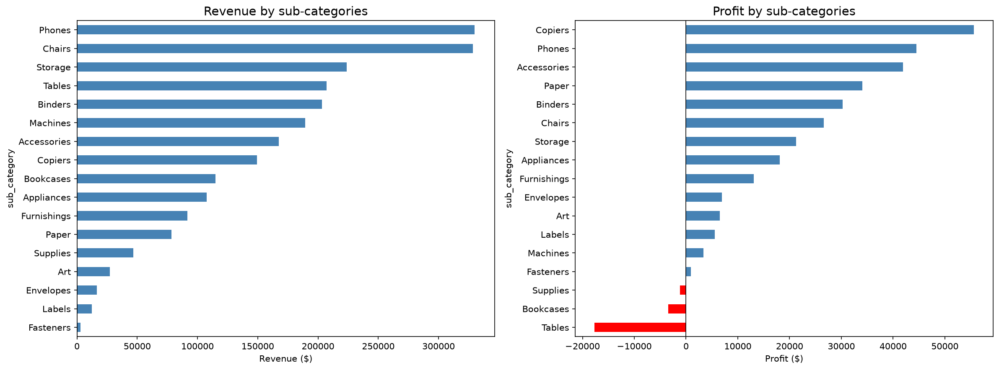
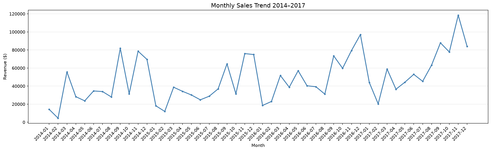
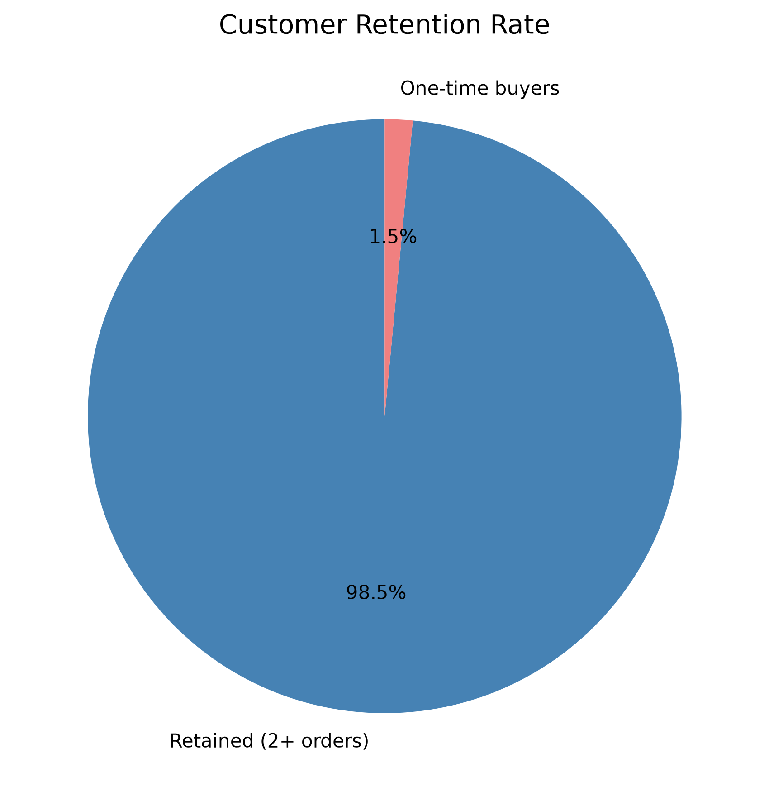
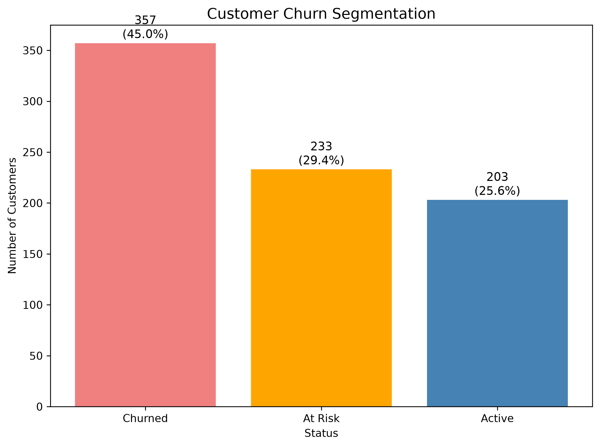
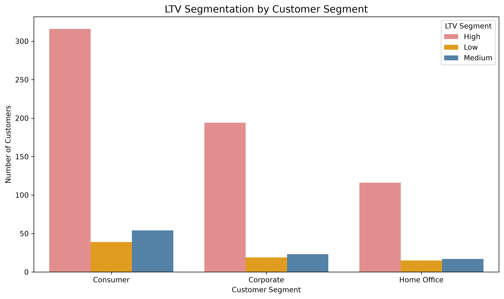

# Superstore Sales Analysis

## Overview
Analysis of 9,994 retail orders (2014–2017) using SQL and Python.  
Tools: PostgreSQL, pandas, Matplotlib, Seaborn

## Business Questions
1. Which product categories drive the most revenue and profit?
2. What is the monthly sales trend (MoM dynamics)?
3. What is the customer retention rate?
4. How are customers segmented by churn risk?
5. What is the LTV distribution across customer segments?

## Key Insights

**1. Category Analysis**
- Tables sub-category has the highest revenue but generates a loss (-$17k profit)
- Supplies sub-category is unprofitable (-$1,189 profit on $46k sales)
- Paper has the best margin at 43% with high sales volume

**2. Monthly Sales Trend**
- Clear seasonality: peaks in September–November, drops in January–February every year
- Recommendation: increase marketing budget before the fall season

**3. Customer Retention**
- 98% of customers made more than one purchase
- Dataset is synthetic — real retail retention averages 20–40%

**4. Churn Segmentation**
- 45% of customers are churned (no purchase in 90+ days)
- 29% are at risk — potential targets for retention campaigns
- Only 25% are currently active

**5. LTV Segmentation**
- High LTV customers (~$3,500 avg) are evenly distributed across segments
- Corporate mid-tier customers show highest LTV among Medium segment
- Purchase frequency strongly correlates with LTV

## Repository Structure

    superstore-analysis/
    ├── README.md
    ├── sql/
    │   └── analysis.sql
    ├── notebooks/
    │   └── superstore_eda.ipynb
    └── images/
        ├── 01_category_analysis.png
        ├── 02_mom_sales.png
        ├── 03_retention.png
        ├── 04_churn.png
        └── 05_ltv_segmentation.png

## Stack
- **SQL**: PostgreSQL — window functions, CTEs, LAG, retention, churn, LTV
- **Java**: pandas, numpy, Matplotlib, Seaborn
- **Tools**: Jupyter Notebook, Postico